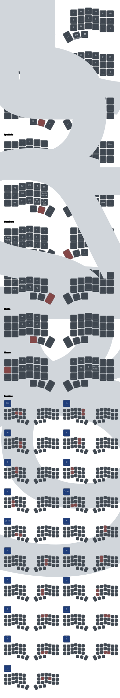

# Corne Wireless Keyboard with ZMK Firmware

> [!CAUTION]
> This is a repository for my personal keymap configuration and for instructions
> on when I need to reflash my keyboard with new firmware. I do not take any responsibility for any
> damage caused if you decide to use the firmware files in the releases section or
> if you follow the instructions below. Proceed at your own risk.

This keyboard was purchased from [keyboardhoarders ](https://www.keyboardhoarders.com/shop) and uses ZMK firmware. It is a split ergonomic keyboard with wireless bluetooth connectivity.

### Features

The keymap currently has a mishmash of features inspired by various layouts I
have seen online. Some of the features include:

- [Homerow mods](https://precondition.github.io/home-row-mods#what-are-home-row-mods)
- [Capsword](https://zmk.dev/docs/config/behaviors#caps-word)
- [Autoshift](https://github.com/nickcoutsos/keymap-editor/wiki/Autoshift-using-ZMK-behaviors), I personlly dont use the approach mentioned and instead use a simpler approach using [Hold-tap](https://zmk.dev/docs/keymaps/behaviors/hold-tap#example-use-cases) behaviour.
- [Mouse emulation](https://zmk.dev/docs/keymaps/behaviors/mouse-emulation)
- [Combos](https://zmk.dev/docs/keymaps/combos)
- Layers
- Urob's [auto-layer](https://github.com/urob/zmk-auto-layer) module (currently
  testing num_word)

### Installation

> [!WARNING]
> Assumptions made here are that you have a keyboard with nice nano v2.
> Also that you are using a windows based pc. The process should be similar for other OS's but I
> have not tested it myself

The [releases page](https://github.com/eb0687/zmk-config-corne/releases) will always contain the latest compiled firmware files for
both halves of the keybaord as well as the reset file.

Download the latest firware and follow the instructiono below to flash the
keybaord:

1. Unzip the downloaded firmware files.
2. Plugin the left half of the keyboard to your pc via usb and put it into bootloader mode, this will open a new directory on your pc. This
   will vary depending on the microcontroller/board you have. Mine is a nine
   nano and the board has a physical button which needs to be pressed twice to enter bootloader mode.
3. Drag and drop the reset file aptly name `settings_reset-nice_nano_v2-zmk` to the newly
   opened directory. (this will reset the keyboard settings and probably wipe
   any previouslly installed firmware). It will automatically eject itself as
   well from the pc once done copying over.
4. Repeat the same process for the right half of the keyboard.
5. At this point both halves of the keyboard should be reset and ready to
   receive the new firmware.
6. Repeat step 2 and 3 for the left half but instead of dragging in the reset
   file, drag in the file called `corne_left nice_view_adapter nice_view-nice_nano_v2-zmk`
7. Repeat this for the right half ensuring that you drag in the right half
   firmware called `corne_right nice_view_adapter nice_view-nice_nano_v2-zmk`

At this point the firmware should be installed and the keyboard ready to use.

If for any reason it does not work as expected, repeat the process again ensurason it does not work as expected, repeat the process again
ensuring that you are draggin in the correct files for each half.

### Usage

Connect the keyboard via bluetooth or usb to the device and your good to go.

Refer to the keymap diagram below for the layout and how to access the various
layers and features.

The keyboard starts in layer 0 called **Base** and is a fairly standard keyboard
layout.

The interesting bits live in the **Test** layer.
To toggle over, you would need to trigger it via a [conditional layer](https://zmk.dev/docs/keymaps/conditional-layers) switch. Refer to the keymap diagram below and look for
the **System** layer. You should be able to see the Test toggle layer key in the
diagram.

### Keymap for Corne Wireless

Below is a diagram of the keymap for the Corne Wireless keyboard courtesy of [keymap-drawer](https://keymap-drawer.streamlit.app/)

### How to switch bluetooth devices.

### Useful resources:

- [ZMK firmware official documentation](https://zmk.dev/docs)
- [ZMK community - discord](https://discord.com/invite/sycytVQ)
- [What are home row mods?](https://precondition.github.io/home-row-mods#what-are-home-row-mods)
- [keyboardhoarders customization guide](https://www.keyboardhoarders.com/post/1288093071901/zmk-change-keymap-walkthrough)
- [keymap-editor](https://nickcoutsos.github.io/keymap-editor/)
- [keymap-drawer](https://keymap-drawer.streamlit.app/)
